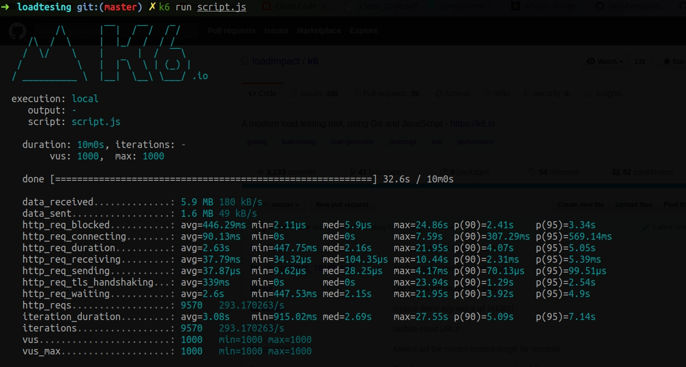

# K6 Load test

## Script load test:
```js
import http from "k6/http";

export let options = {
    vus: 1000, // 1000 virtual user
    duration: '600s',
}

export default function() {
    let response = http.get("https://dacnpm-group05.herokuapp.com");
};
```

## Options:

Load test api: `https://dacnpm-group05.herokuapp.com` trong `600s` với 1000 user truy cập đồng thời

## Run script

Required: install [K6](https://github.com/loadimpact/k6)

Đứng ở thư mục: `./loadtesting`
```bash
k6 run script.js
```

## Sample result
